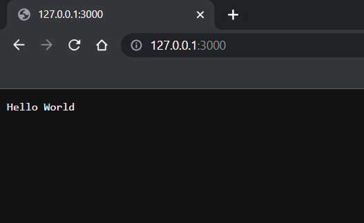

# What is Node.js?

“Node.js is an open-source, cross-platform JavaScript runtime environment.”, this is the official definition we can find online, but what does it mean?

Node.js is based on Javascript, so it means we can “do backend” with **Javascript**!

In order to install Node.js, we have to install NVM from the following link:

[Download & Install NVM](https://www.freecodecamp.org/news/node-version-manager-nvm-install-guide/)

After we downloaded it, we'll use it to install Node.js 16.

```bash
nvm install v16.20.1
```

Here’s an example of a server written in Node.js.

```jsx
const http = require("http");

const hostname = "127.0.0.1";
const port = 3000;

const server = http.createServer((req, res) => {
  res.statusCode = 200;
  res.setHeader("Content-Type", "text/plain");
  res.end("Hello World");
});

server.listen(port, hostname, () => {
  console.log(`Server running at http://${hostname}:${port}/`);
});
```

Basically this code opens an HTTP port inside our computer that now runs the code we wrote.

To execute this we simply have to save this code in a Javascript file, say `server.js`, and execute it by opening a terminal in the same folder and writing the following command:

```bash
node server.js
```

Which will output:

```bash
node server.js
Server running at http://127.0.0.1:3000/
```

And if we visit that link:



We’ve just made our first Node.js server!
