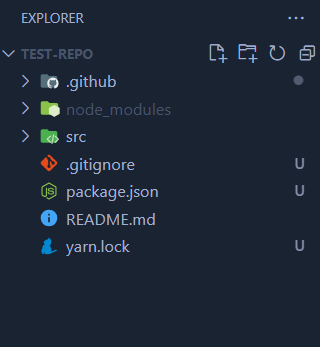
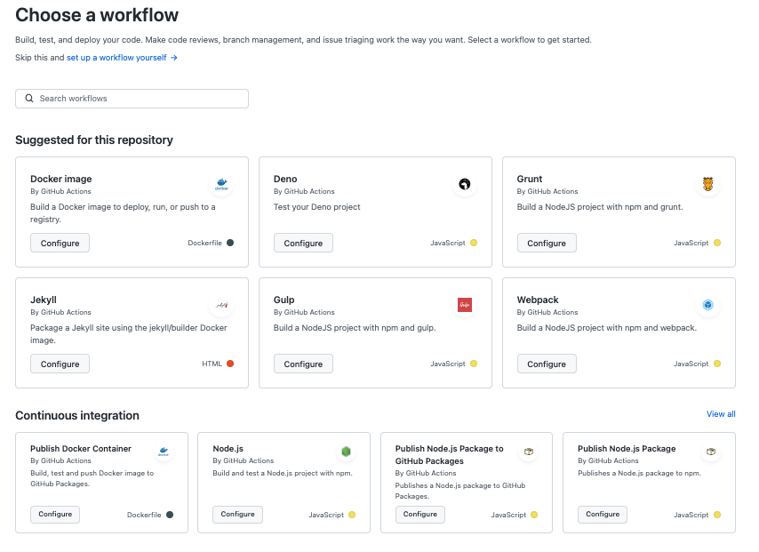
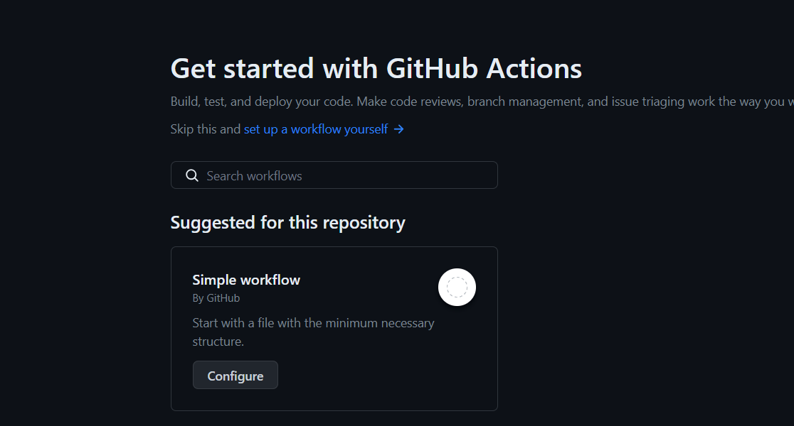
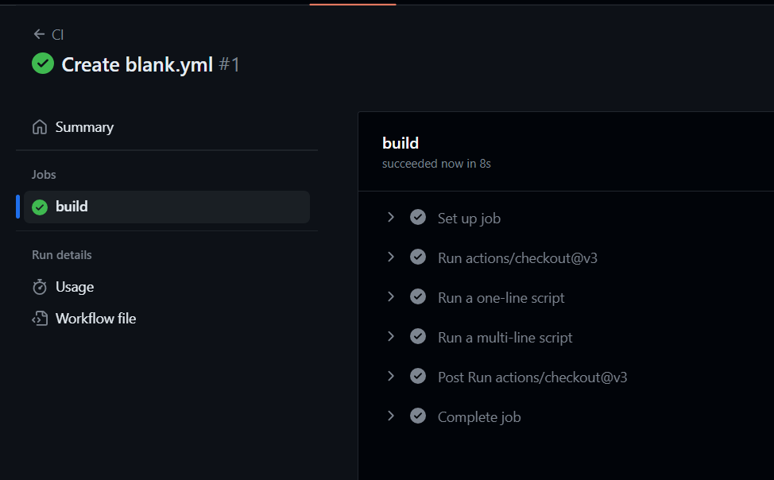

# GitHub Actions

## What is GitHub Actions?

GitHub Actions is an automation platform provided by GitHub that allows you to automate various tasks and workflows within your software development projects. It integrates seamlessly with your GitHub repositories and helps you build, test, and deploy your code more efficiently. Here are some key points about GitHub Actions:

1. **Workflow Automation**: GitHub Actions enables you to create custom workflows to automate tasks such as building and testing your code, deploying applications, and even managing issue triage or documentation generation.

2. **YAML Configuration**: Workflows in GitHub Actions are defined using YAML configuration files that are stored within your repository. These YAML files specify the steps to be executed and the conditions under which they should run.

3. **Event-Driven**: Workflows can be triggered by various events, including code pushes, pull requests, issue comments, and scheduled times. This event-driven nature allows you to respond to changes in your repository automatically.

4. **Parallel and Matrix Builds**: GitHub Actions supports parallel and matrix builds, allowing you to run tests or build and test your code on multiple versions of programming languages, platforms, or configurations simultaneously.

5. **Reusable Actions**: GitHub Actions offers a marketplace of pre-built actions, which are reusable units of automation that you can incorporate into your workflows. You can also create custom actions tailored to your specific needs.

6. **Integration with Other Services**: Actions can interact with external services, making it easy to integrate with cloud platforms, deployment services, notification systems, and more.

7. **Secrets Management**: GitHub Actions provides a secure way to manage and use secrets, such as API keys or credentials, in your workflows, ensuring sensitive information is protected.

8. **Visual Workflow Editor**: GitHub also offers a visual workflow editor that simplifies the creation and modification of workflows for those who prefer a graphical interface.

9. **Insights and Logs**: GitHub Actions provides detailed logs and insights into the execution of your workflows, helping you diagnose issues and track the progress of automation tasks.

10. **Community and Ecosystem**: GitHub Actions benefits from a large and active community, which contributes to a wide range of available actions and provides support through discussions and documentation.

GitHub Actions is a powerful tool for streamlining your software development processes, improving code quality, and accelerating deployment pipelines. It's widely used in both open-source and private repositories to automate repetitive tasks and enhance collaboration among development teams.

## Project Setup

### **Step 1: Repository Selection**

The initial step in establishing a CI pipeline using GitHub Actions involves either creating a new repository on GitHub or selecting an existing one. You have the flexibility to use your current project's codebase, fork a project from GitHub, or start from scratch.

So let's start by creating a repository on GitHub and cloning it locally.



A folder named `.github` will be needed so we'll have to create it.

### **Step 2: Access GitHub Actions**

To initiate the creation of your CI/CD pipeline, open the GitHub Actions tab located in the top navigation bar of your repository.

You will find a variety of CI/CD and workflow automation templates tailored to match the technologies employed in your project.



We'll select the simple workflow option and write one ourselves.



### **Step 3: Trigger CI/CD Pipeline**

After selecting that option, we'll see an example of a workflow:

```yaml
# This is a basic workflow to help you get started with Actions

name: CI

# Controls when the workflow will run
on:
  # Triggers the workflow on push or pull request events but only for the "main" branch
  push:
    branches: ["main"]
  pull_request:
    branches: ["main"]

  # Allows you to run this workflow manually from the Actions tab
  workflow_dispatch:

# A workflow run is made up of one or more jobs that can run sequentially or in parallel
jobs:
  # This workflow contains a single job called "build"
  build:
    # The type of runner that the job will run on
    runs-on: ubuntu-latest

    # Steps represent a sequence of tasks that will be executed as part of the job
    steps:
      # Checks-out your repository under $GITHUB_WORKSPACE, so your job can access it
      - uses: actions/checkout@v3

      # Runs a single command using the runners shell
      - name: Run a one-line script
        run: echo Hello, world!

      # Runs a set of commands using the runners shell
      - name: Run a multi-line script
        run: |
          echo Add other actions to build,
          echo test, and deploy your project.
```

In summary, this workflow will be triggered in the branch `main` every time a commit is pushed or a request is pulled. When triggered, it checks out the code and runs a simple script. We'll have to expand this workflow by adding more steps to perform tasks like building and testing our project. Once committed it will immediately be run.



More information about actions: https://docs.github.com/en/actions

### **Step 4: Monitor Pipeline Execution**

After pushing the code change, you can observe your CI/CD pipeline in action using the workflow visualizer and live logs.

The workflow visualizer, accessible via the Actions main page, provides a graphical representation of your workflow, displaying when each job occurs and indicating their status with green check marks, yellow signs, or red signs for success, ongoing tasks, or failures, respectively.

Live logs, accessible through the Actions menu, are invaluable for diagnosing issues. They offer timestamps, raw logs, and the option to download logs for local reference. While you may not need live logs if your pipeline is set up correctly, they are indispensable for troubleshooting when things go wrong.

With GitHub Actions, building a CI/CD pipeline is a straightforward process, allowing you to focus on your code's functionality and quality. Whether you're working on an open-source project, a personal endeavor, or a professional project, adopting CI/CD brings benefits like consistent and reliable releases. Trust that your code works as intended after merging, testing, and deployment.
