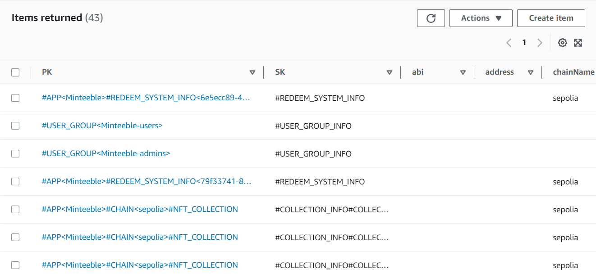
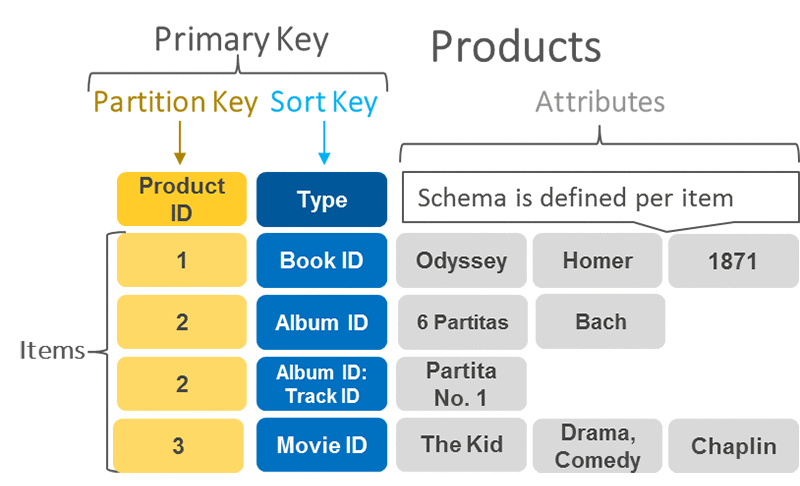
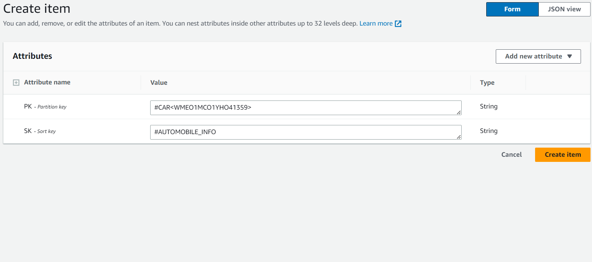
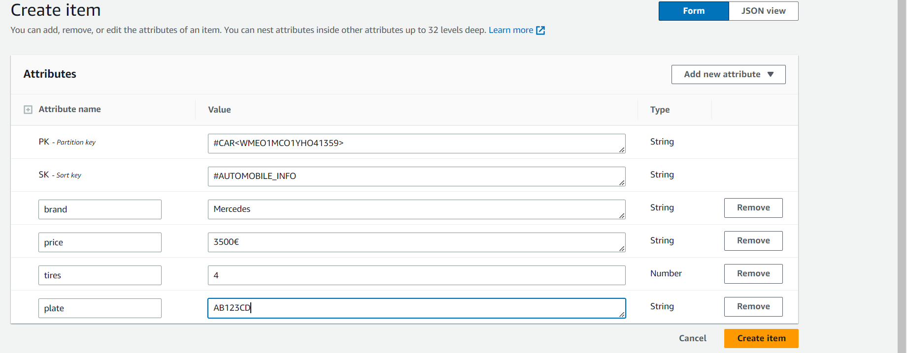
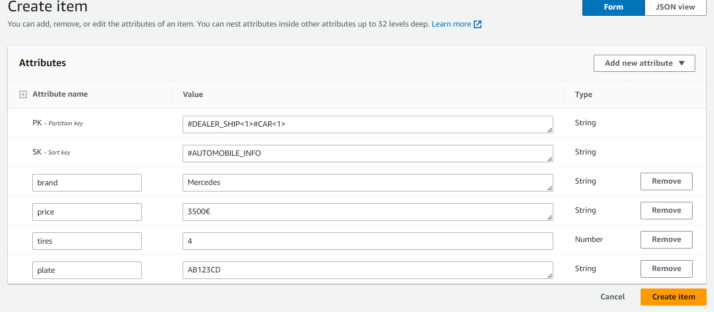

# Databases

A crucial aspect for a backend developer is working with databases.

A database is a tool where the data of a website is stored or, more specifically, created, read, updated and deleted. There are two main types of databases: **relational** databases (such as MySQL, PostgreSQL) and **non-relational** databases (such as MongoDB, Cassandra, DynamoDB).

Relational databases store data in tables with **predefined schemas and relationships**.

Non-relational databases store data in collections **with flexible schemas** and **no fixed relationships**. Each type of database has its own advantages and disadvantages depending on the use case.

As with everything in the backend (and actually in the frontend, too), a choice has to be pondered based on the requirements, demands and skills.

Our database choice is **DynamoDB**, a blanzingly fast database designed to run high-performance applications, owned by Amazon AWS.

DynamoDB is a non-relational database, an example of a table shows up like this:

As we said, the records of a non-relational database like DynamoDB possess no fixed relationships. A record is mainly characterised by:

- **Partition Key**
- **Sort Key**
- **Attributes**
- **Global Secondary Index Keys**

So a record, or **item**, is defined by its keys and its attributes. Let’s take the first item, its partition key matches with the product ID $1$, its sort key matches with the ID of the book, for example an ISBN. The attributes contain information about the single and specific item, for example the title, who wrote it, when it was published etc…

You may think that every database schema created with DynamoDB has this structure, but, in reality, there’s no real set of rules that establishes what structure to follow, we’re free of rules, so we’re going to explain the way we use them.

Let’s suppose we own a car dealership and we want to store the information about the cars. A car is uniquely identified by its frame number, we’ll obviously use piece of information to identify a car inside the database.

Now, say we want to distinguish between an automobile and a scooter, to do this, we’ll use the sort key.

So, initially, a record will be something like this:

Now we’ll add some attributes about the item, say, brand, number of tires, price and plate:

Our record is now complete.

Now, let’s suppose there’s more than one piece of information to identify an item in the database. For example, let’s suppose we own multiple car dealerships and we want to assign the car an arbitrary incremental ID rather than the frame number.

We’ve now got two pieces of information to identify a car, the dealership and the ID. So, an item will be something like this:

