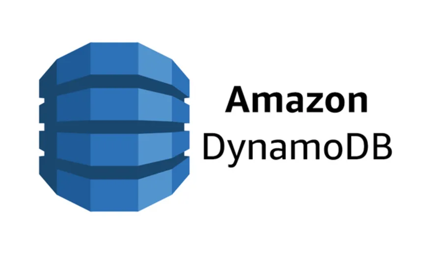

# Databases

A crucial aspect for a backend developer is working with databases.

A database is a tool where the data of a website is stored or, more specifically, created, read, updated and deleted. There are two main types of databases: **relational** databases (such as MySQL, PostgreSQL) and **non-relational** databases (such as MongoDB, Cassandra, DynamoDB).

Relational databases store data in tables with **predefined schemas and relationships**.

Non-relational databases store data in collections **with flexible schemas** and **no fixed relationships**. Each type of database has its own advantages and disadvantages depending on the use case.

As with everything in the backend (and actually in the frontend, too), a choice has to be pondered based on the requirements, demands and skills.

Our database choice is **DynamoDB**, a blanzingly fast database designed to run high-performance applications, owned by Amazon AWS.

