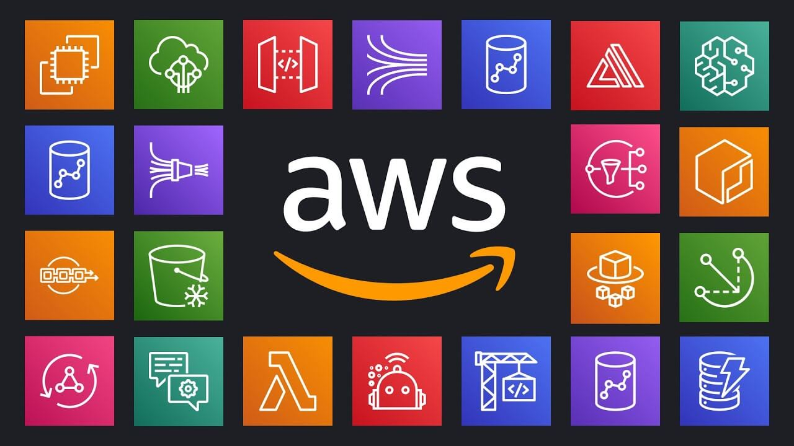

# Hosting Environments

Another aspect of backend development is managing servers and hosting environments: servers run the backend code and handle requests from the frontend.

A backend developer needs to configure, deploy, and maintain servers and hosting environments for their project. There are different types of servers, such as local servers on the developer's machine, or cloud servers provided by services like Microsoft Azure, AWS, and Google Cloud Platform.

Dedicated servers are rented for exclusive use, while shared servers are used by multiple projects. Choosing the right server and hosting environment depends on factors like cost, scalability, security, and reliability.

There are different types of servers and hosting environments, such as local servers, cloud servers, dedicated servers, shared servers, etc.

Local servers are the servers that run on the backend developer's own machine or network.

Cloud servers are the servers that run on a remote platform provided by a cloud service provider such as Microsoft Azure, AWS (Amazon Web Services), Google Cloud Platform, etc.

Dedicated servers are the servers that are rented by the backend developer from a hosting provider and used exclusively for their project.

Shared servers are the servers that are shared by multiple projects from different backend developer.

Our backend runs on an Amazon AWS cloud server, and, specifically, we use the serverless computing.

