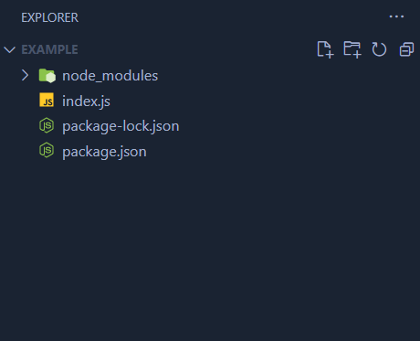

# Package Managers

A package manager, in the context of a project, is a **Command Line Interface** (CLI) that helps us installing packages, managing dependencies and managing versions.

The default package manager of Node.js is **npm**. Let’s how to use it for creating a project.

npm comes with the installation of Node.js by default, so you should be able to open a command terminal, write npm and see the help page.

# Using npm a for a project with Node.js

Let’s start by creating a project folder and opening a terminal in there and executing the following command:

```bash
npm init
```

Just skip and press ENTER to all the questions for now.

A file named `package.json` should now be present:

```json
{
  "name": "example",
  "version": "1.0.0",
  "description": "",
  "main": "index.js",
  "scripts": {
    "test": "echo \"Error: no test specified\" && exit 1"
  },
  "author": "",
  "license": "ISC"
}
```

Each of these entries in this JSON document has its meaning:

- `name`, the name of the project as it will appear if you publish the project as a package.
- `version`, the version of the project, crucial if you also publish the project
- `description`, the description of the project
- `main`, the main entry point of the project,
- `scripts`, a way to automatically execute commands by calling npm, in this example `npm test`, will execute `echo \"Error: no test specified\" && exit 1`

If you want to read more consult:

[package.json | npm Docs](https://docs.npmjs.com/cli/v9/configuring-npm/package-json)

Now, let’s create a file named `index.js`. Let’s suppose we want to do a comparison between two JSON objects:

```jsx
//index.js

function main() {
  let obj1 = { name: "John", surname: "Doe", age: 34 };
  let obj2 = { name: "Jane", surname: "Smith", age: 32 };
}

main();
```

If we wanted to compare these two objects we would have to write a complex function. We don’t have to reinvent the weel, we could download a package that does exactly what we need to do, the name of this package is `lodash`.

How do we install it? We have to run `npm install lodash` in the root of the project. Once run, this is how our project folder will look like:



The `package-lock.json` file contains the dependency tree that was generated for the project, whereas the `node_modules` folder contains all the code of the installed packages.

```json
{
  "name": "example",
  "version": "1.0.0",
  "description": "",
  "main": "index.js",
  "scripts": {
    "test": "echo \"Error: no test specified\" && exit 1"
  },
  "author": "",
  "license": "ISC",
  "dependencies": {
    "lodash": "^4.17.21"
  }
}
```

As we see, the project possesses now a dependency. We are now able to use the code contained in the package we installed, so let’s use it:

```jsx
//index.js

const _ = require("lodash");

function main() {
  let obj1 = { name: "John", surname: "Doe", age: 34 };
  let obj2 = { name: "Jane", surname: "Smith", age: 32 };

  console.log(_.isEqual(obj1, obj2));
}

main();
```

Another important difference we have to talk about is between **dependencies** and **devDependencies**. Basically, **devDependencies** are the type of dependencies that the program doesn’t need when run in production so they don’t have to be included in the environment production.

Let’s make an example:

Suppose we want to use a test runner in our project. We actually don’t need the code of this package in the production environment since we only need it during the development phase. So we’ll want to add it as a devDependency with the following command:

```bash
npm install --save-dev jest
```

The `package.json` file has changed again:

```json
{
  "name": "example",
  "version": "1.0.0",
  "description": "",
  "main": "index.js",
  "scripts": {
    "test": "echo \"Error: no test specified\" && exit 1"
  },
  "author": "",
  "license": "ISC",
  "dependencies": {
    "lodash": "^4.17.21"
  },
  "devDependencies": {
    "jest": "^29.6.1"
  }
}
```

We can now use the code of that package.

To remove a package, for example `lodash`, we can run the following command:

```json
npm rm lodash
```

Let’s now talk about **peerDependencies**

peerDependencies are dependencies that your project requires to work, but that needs to be provided by the environment production. In other words, .

To list peer dependencies in your `package.json` file, you can add a `peerDependencies` property. For example:

```
{
  "name": "my-package",
  "version": "1.0.0",
  "peerDependencies": {
    "react": "^17.0.2"
  }
}

```

This means that your package requires React to work, but it's not going to be installed automatically when someone installs your package. Instead, the user needs to install React manually.

Remember that peer dependencies are not installed automatically, so it's important to make sure that the user is aware of them and knows how to install them.

For more information, consult the [npm documentation on peer dependencies](https://docs.npmjs.com/cli/v7/configuring-npm/package-json#peerdependencies).

A quick cheatsheet about npm:

[npm cheatsheet](https://devhints.io/npm)
