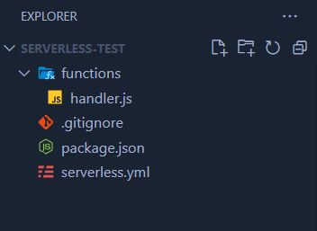
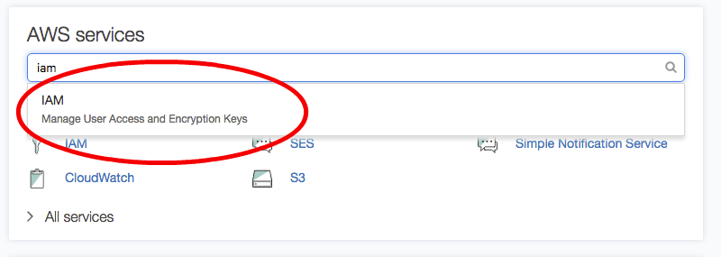
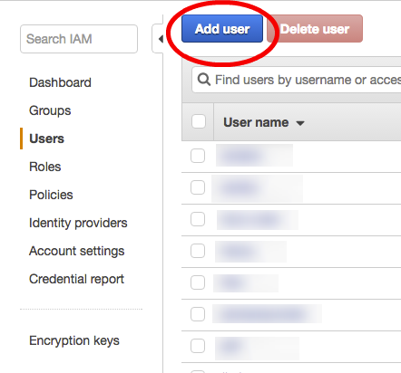
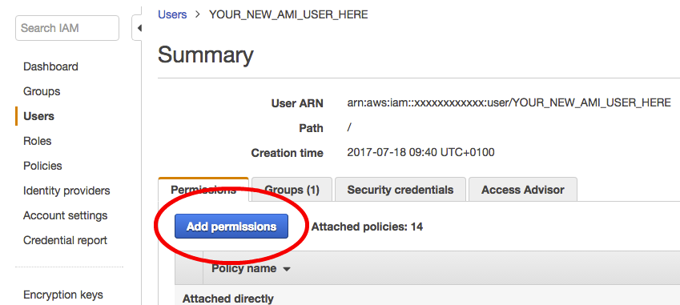
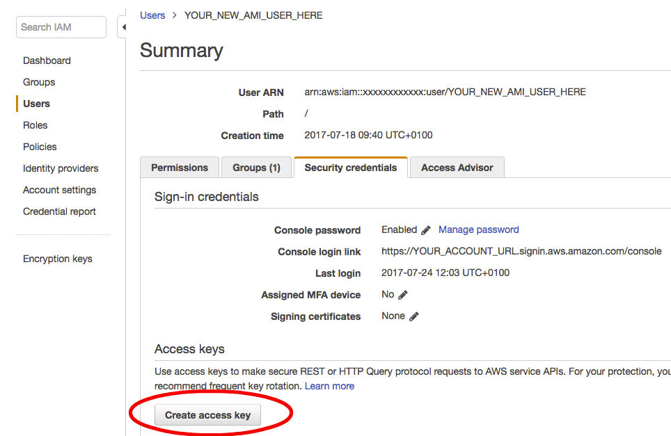
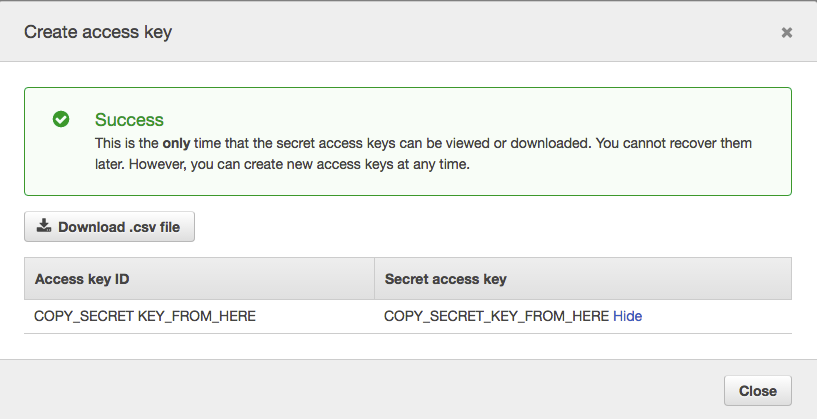

# AWS Serverless

# Introduction

AWS Serverless is a cloud computing model that allows you to build and run applications without managing servers. Instead of provisioning and maintaining servers, you focus on writing code and defining the functions that your application needs. AWS takes care of the infrastructure, scaling, and server management, making it easier and more cost-effective to build and deploy applications.

# AWS Lambda

AWS Lambda is a serverless compute service provided by AWS that enables you to run code without provisioning or managing servers. It allows you to execute functions in response to various events, such as changes in data, HTTP requests, or scheduled tasks. AWS Lambda automatically manages the underlying infrastructure, scaling, and monitoring, making it an ideal choice for building highly scalable and cost-effective applications

## **Event-Driven**

Lambda functions are triggered by events. These events can come from various AWS services (e.g., S3, DynamoDB, SNS) or external sources through API Gateway or custom event sources.

## **Auto Scaling**

AWS Lambda automatically scales your functions in response to incoming traffic. You don't need to configure the number of servers; AWS handles it for you.

# Project Setup

In this tutorial we’re going to setup and deploy a serverless application.

## Prequisites

Make sure you have an AWS account, have `aws-cli` installed and at least NodeJS version 6.

## Installation

### Step 1 - Serverless installation

Install the [Serverless](https://serverless.com/) framework on your machine via npm by running this command:

```bash
npm install serverless -g
```

We have used a global install here for convenience however ideally you would use a local install for a real project so that the version of the Serverless framework remains consistent for that particular project.

### Step 2 - Create project

Create a simple hello-world project using a template built into the Serverless command line tool:

```bash
mkdir serverless-test
cd serverless-test
serverless create --template hello-world
yarn init
```

This will create two files:

- `serverless.yml` - this is used to configure lambda endpoints and/or events for lambdas invocation. Most of the configuration is done there. The list of available properties and settings can be found in the [Serverless documentation.](https://serverless.com/framework/docs/providers/aws/guide/serverless.yml/)

```yaml
# serverless.yml
# Welcome to serverless. Read the docs
# https://serverless.com/framework/docs/

# Serverless.yml is the configuration the CLI
# uses to deploy your code to your provider of choice

# The `service` block is the name of the service
service: serverless-hello-world

# The `provider` block defines where your service will be deployed
provider:
  name: aws
  runtime: nodejs18.x

# The `functions` block defines what code to deploy
functions:
  helloWorld:
    handler: handler.helloWorld
    # The `events` block defines how to trigger the handler.helloWorld code
    events:
      - http:
          path: hello-world
          method: get
          cors:true

```

- `handlers.js` - this contains the hello-world endpoint.

```jsx
//handlers.js
"use strict";

module.exports.helloWorld = (event, context, callback) => {
  const response = {
    statusCode: 200,
    headers: {
      "Access-Control-Allow-Origin": "*", // Required for CORS support to work
    },
    body: JSON.stringify({
      message: "Go Serverless v1.0! Your function executed successfully!",
      input: event,
    }),
  };

  callback(null, response);
};
```

Let’s create a new folder called `functions` and move `handlers.js` into it like this:



### **Step 3 - Create AWS credentials**

If you have not used aws-cli before you will need to create credentials for it so that the serverless framework is able to connect to your AWS environment. Detailed instructions on how to do this is available from the [Serverless website.](https://serverless.com/framework/docs/providers/aws/guide/credentials/)

Once you have done that you will need to allow your AWS user permissions to deploy a Serverless application.

- In the AWS console go to the IAM service -> Users -> *IAM Manage User Access and Encryption Keys*



- Choose your existing user or create a new user.

Ensure the user has the following permissions:

- `AWSLambdaExecute`
- `AWSLambdaRole`
- `AWSLambdaFullAccess`
- `AWSLambdaRole`
- `AWSCloudFormationReadOnlyAccess`









### **Step 4 - Configure serverless with your AWS credentials**

Now you can use Serverless Framework to save the credentials in a way that the aws-cli can understand them by running the following command.

```bash
serverless config credentials --provider aws --key YOUR_ACCESS_KEY --secret YOUR_ACCESS_SECRET
```

### **Step 5 - Deploy your lambda function**

Deploy your Lambda function to AWS using the following command. (the `--verbose` flag will output full logs of your deployment)

```bash
serverless deploy --verbose
```

As you may be able to see in the output this creates quite a few AWS resources. Behind the scenes it creates a code bundle and new CloudFormation stack that does the following:

- Uploads your code to S3.
- Creates a lambda function from your code
- Creates an API gateway api and endpoint that points to your new function.
- Creates a CloudWatch log group for your function

You can view the files uploaded to S3 in the `.serverless` folder that the deploy command creates.

### **Try it out**

The output from the above deployment command will print the endpoint API Gateway of the deployed function similar to the example below. Just open it in a browser to test the Lambda function works.

```
endpoints:
  GET - https://qewroweire.execute-api.us-east-1.amazonaws.com/dev/hello-world
```

For more information on API gateway urls see [this page](https://sls.zone/pages/learn/finding-api-gateway-urls/) on how to find out what yours is after deployment.
