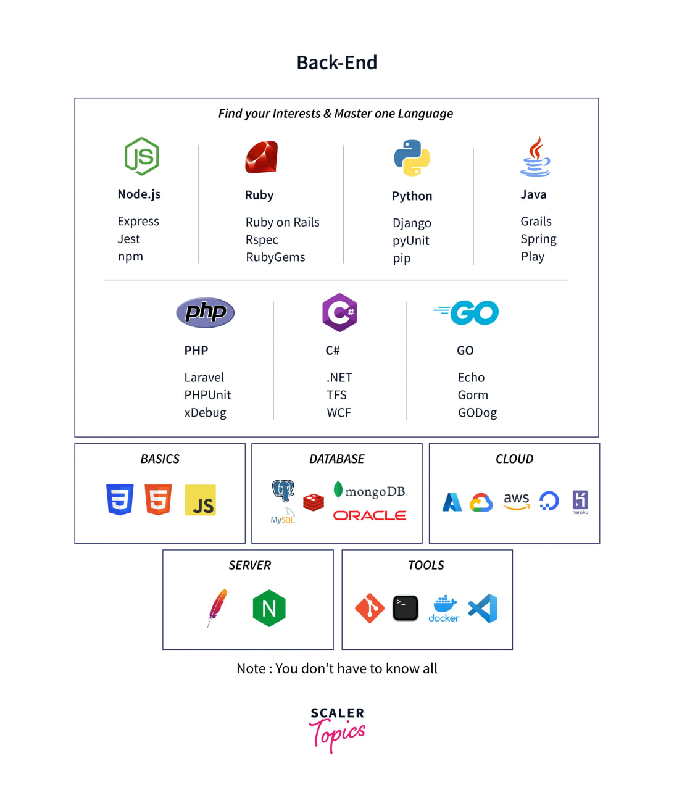

## Introduction

# What is Backend Development?

First of all, we have to introduce what means to “do Backend”.

The “Backend” term is really generic, it means to be able to work and manage various technologies.

Now, don’t be scared by this picture, we won’t be working with all these technologies, nor you need to know every one of them.

Particularly, “Backend development” can be subdivided into the following categories:

1. **Backend languages**
2. **Databases**
3. **APIs**
4. **Hosting environments**
5. **Testing & debugging code**
6. **Security**
7. **Caching & Optimization**

We’ll now delve into each one of these categories.
