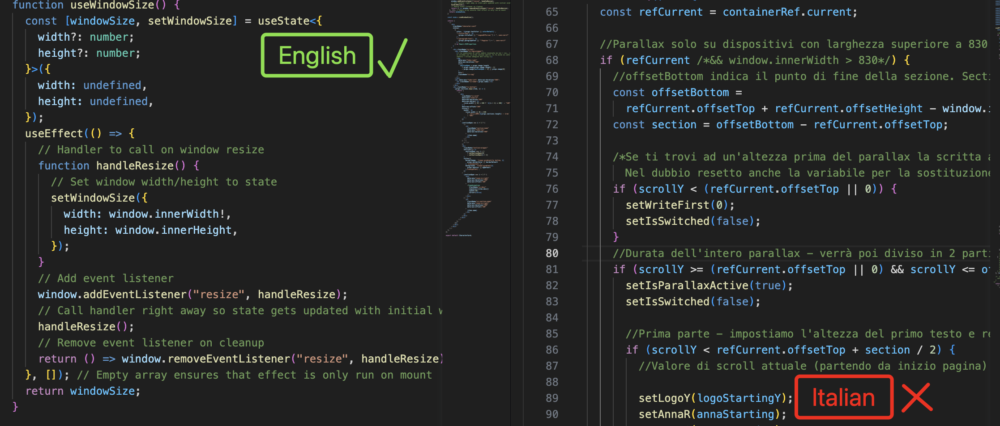

## Denomination Conventions 🗣️👀

# Each element has its own denomination.

Remember that each element and file has its own denomination conventions.

> Denomination example:
> camelCase, kebab-case, PascalCase, UPPERCASE, lowercase etc...
> **_SEE NOTE_**

Images use kebab-case (both folder names and content). In any case, spaces MUST NOT be used.
JavaScript variables are written in camelCase, while component and page folder names use PascalCase.

> **EXCEPTION**
> Page names must always end with "Page," so for example:
> Home --> HomePage
> about-info--> AboutInfoPage

