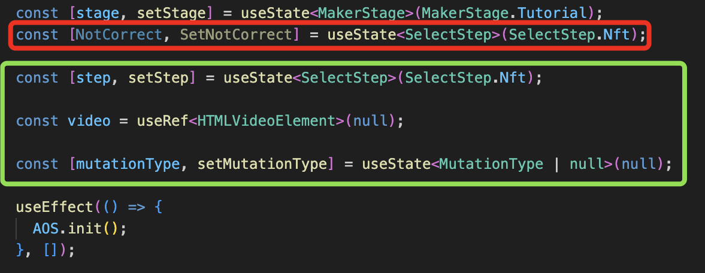
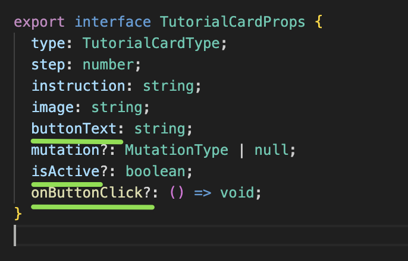
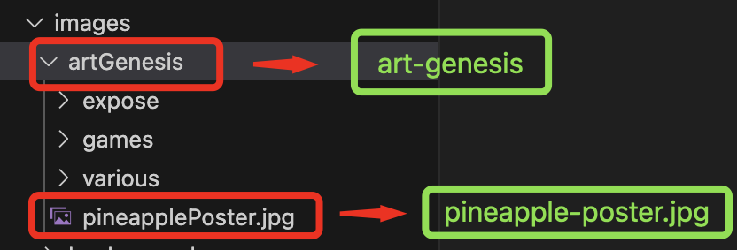
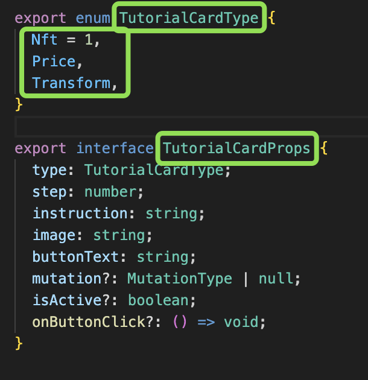

# List of examples 📜

## camelCase

> helloWorld, thisIs aMessage writtenUsing camelCase

This denomination is applied to anything **js-related**: variables, props, useState, useEffect.

_variables, useState, useRef_

_props_

## kebab-case

> hello-world, this-is a-message written-using kebab-case

This denomination is applied to **file names of images, fonts, subfolders, and content**.

_images, fonts_

## PascalCase

> HelloWorld, ThisIs AMessage WrittenUsing PascalCase

This denomination is applied to **enum, interfaces, folder names "pages" and "components" + contents of each individual file (excluding index.ts)**.

_enum e contenuto, interface_

_pages_

_components_
