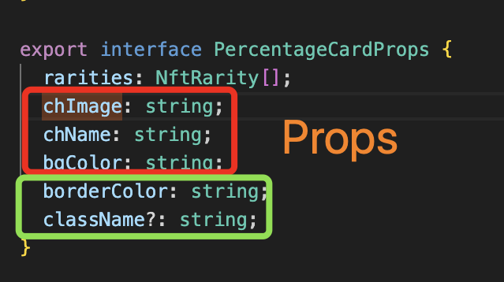

## Descriptive Denomination 📝⭐️

# Every denomination must be descriptive

Sometimes, when naming a JavaScript variable for the sake of speed or convenience, one may prefer to abbreviate the name. However, this writing style is not recommended, especially for those external to the project who need to interpret both the logic and a simple variable name.

In the example below, we are naming a list of props to be passed to a component. Let's take a look at the three props: `chImage`, `chName`, `bgColor`. Only those who have actively participated in the project (or have great intuition) can understand that `chImage` refers to `characterImage` and `bgColor` refers to `backgroundColor`.To avoid, as mentioned earlier, forcing someone to interpret the name of a variable or other elements, it is preferable to avoid abbreviations.

