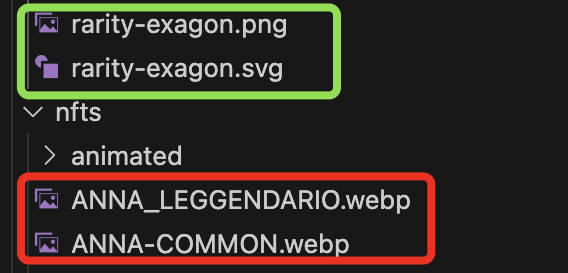

## General Denomination 🌎🏆

# Every denomination must be general

REvery denomination must be general and not specific. Regarding file names, variables, and other elements, one should always be careful with the names chosen. In fact, giving a specific name like "X" may become inconvenient in the future if it needs to be changed to "Y." Let's illustrate with an example:

In this project, there were two possible gradients to use, and it was decided to use a variable to write the corresponding linear-gradient once and use it throughout the codebase. The variable names chosen were `--gradient` for the purple gradient and `--green-gradient` for the green gradient. So far, everything seems fine.

Now, imagine that you have used the `--green-gradient` variable in many parts of the code, and suddenly, the green linear-gradient `(--green-gradient)` needs to be changed to a completely different blue-toned linear-gradient. In many CSS sections, you will find elements with this gradient called `--green-gradient`, which now has blue tones instead. It clashes a bit.

To prevent this issue, it's better to use more general names, such as `--primary-gradient` and `--secondary-gradient` instead of `--green-gradient`. This way, if any modifications are needed in the future, it won't cause confusion or inconsistencies in the codebase.

