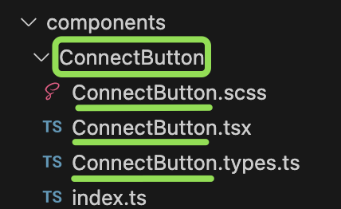
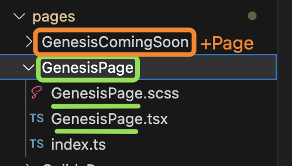

## Components/Pages folder

Inside the `components` and `pages` folders, you will find the respective components and created pages.

Within these two parent folders (**components** and **pages**), it is essential to follow the same naming convention. Every file and folder within these parent folders should adhere to **PascalCase**: similar to **camelCase**, but with the distinction that the first letter is capitalized, and there are no spaces. In the case of pages, the name should be followed by the word `Page`.

**Example:** `components/HomeComponents/About/` (folder contents)

**Example:** `pages/HomePage/` (folder contents)

_components folder_

_pages folder_
