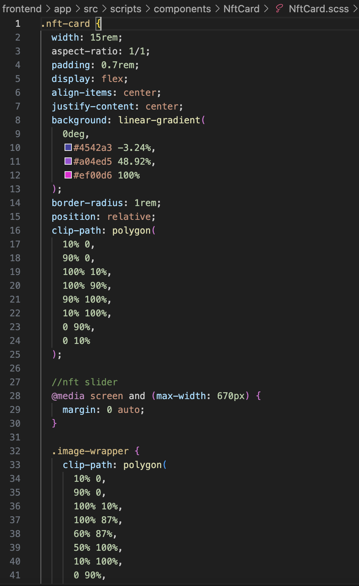
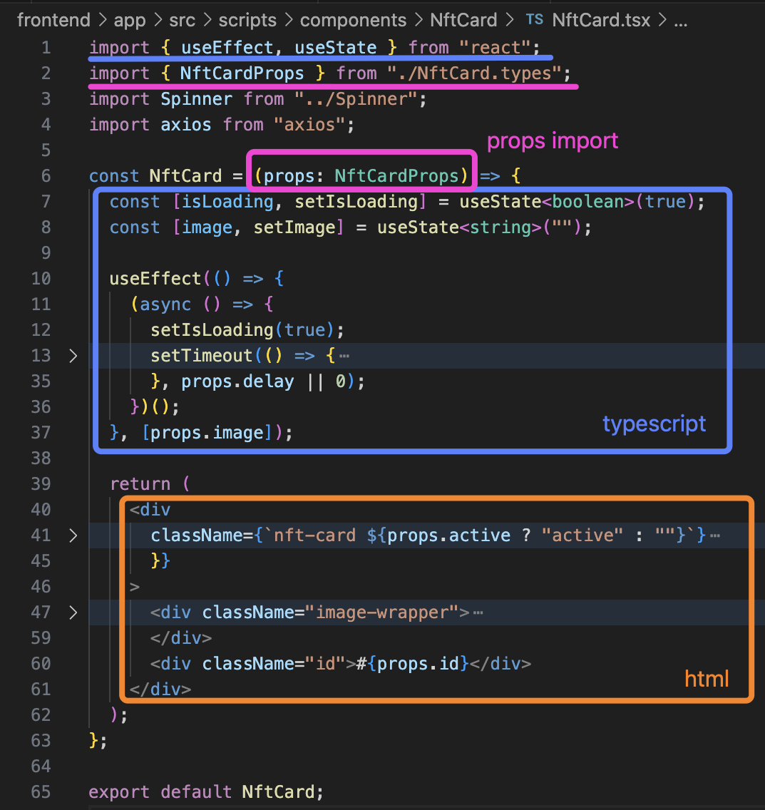
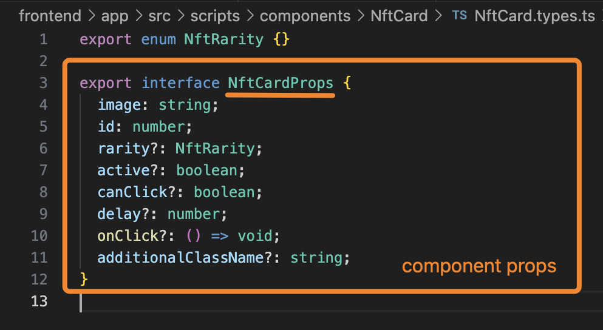
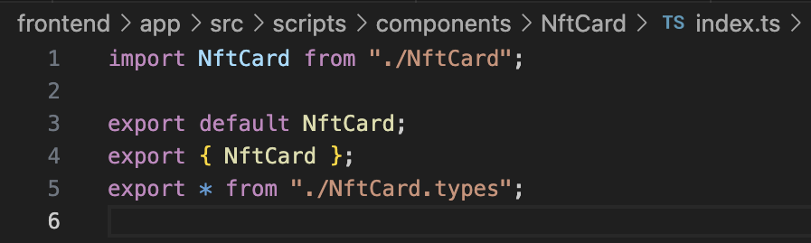

The individual component and the single page share the same structure; both have three types of files: `file.scss`, `file.tsx`, and `index.ts`. Additionally, the individual component includes the `file.types.ts` file.

## File.scss

It contains the CSS code, defining the style that the component will have.


## File.tsx

It contains the HTML code, defining the structure composed of divs, text elements such as h1, h2, p, and all other HTML elements, but not limited to these. In fact, File.tsx may also include `useState` and `useEffect` and JavaScript logic translated into TypeScript. Additionally, it may have imports of external components used within the component or external libraries (e.g., a specific component library). The props from the .types file are exported by specifying "(type) FileProps" within parentheses.

The original structure of a component/page is the same for all:

```tsx
<></>
const File = () => {
  return (<></>)
}
export default File
<></>
```



## File.types.ts

It contains the JavaScript code translated into TypeScript, including functions, enums, constructors, and JavaScript classes, among others. This code is imported within the `File.tsx` file.


## index.ts

It contains the import of the entire component's code. HINT: All `index.ts` files have the same structure.

