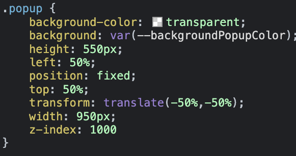

# Styles folder

## main.scss

In this file, you will find imports for the styles from the pages and components folders, as well as other .scss files present in the styles directory.

## general.scss

This file contains general CSS properties, such as the removal of the underline from the `<a>` element.

## colors.scss

Here, you can find variables for commonly used colors, especially in scenarios like dark/light mode.

## fonts.scss

This file is used to import fonts from external sources like Google Fonts or, if downloaded and imported into the files folder, configure them using `@font-face`, specifying the font-family and src. Optional parameters include format, font-weight, and font-style.

---

It is essential to differentiate between CSS and SCSS variables. CSS variables are more dynamic as they update automatically, enabling features like dark mode. On the other hand, SCSS variables are replaced by the chosen color during compilation and cannot be updated.

In the example below, `var(--backgroundPopupColor)` is a CSS variable. Once rendered on the website, the background property will have a value associated with a variable that can assume any color.

If it were an SCSS variable, the background property would have the value of the color associated with the variable, making it impossible to update a color dynamically.

