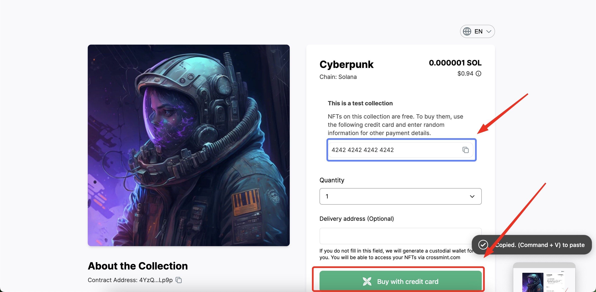

# Crossmint 🚀️

**Crossmint** offers many features, but the main function we will use is called **"payments"**. What does it allow us to do? Simply put, it allows users to mint an NFT from an NFT collection on a wide range of blockchains, such as Ethereum, Polygon, BSC, and even Solana.

The official website of **Crossmint** is [https://www.crossmint.io/](https://www.crossmint.io/). On the next page, you will see how to create a developer account, although most of the time we will use the client's personal account. Every time a new account is created, it will need to be verified with identification documents. And for each registered NFT collection, a small questionnaire needs to be filled out.

### How does it work? 🤔️

After registering and configuring the collection, **Crossmint** will be able to act as an intermediary between the NFT smart contract and the user. Through a dedicated pop-up on the NFT collection website, the user can make payment using Apple Pay or Google Pay. Crossmint's system automatically mints the NFT on behalf of the user using a custodial wallet. The advantage of using it is that anyone can mint an NFT without necessarily having expertise in the blockchain industry. In fact, no wallet is required to mint the NFT, as Cross...

#### Test Crossmint

To get a clearer idea of how Crossmint works, we can perform a test mint with non-real data. As a first step, please connect to the following page:

