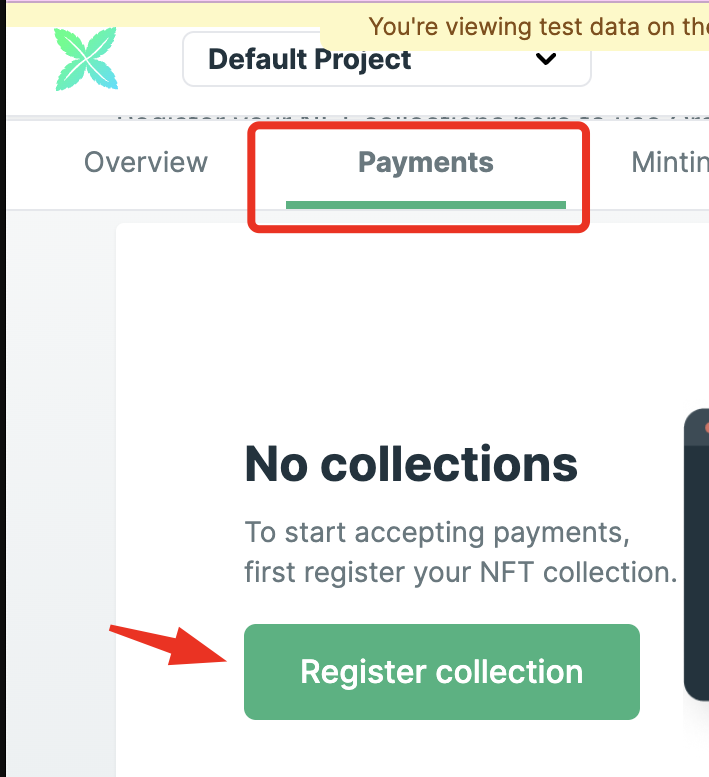

## Leveraging NFT Drop for Credit Card Payments 🦾

This guide provides a **brief overview** of how you can leverage an existing NFT drop and its corresponding website to start accepting credit card payments in less than five minutes.

### Pre-requisites ⚙️

Before we proceed, ensure that you have an **NFT drop deployed** on a testnet. You'll need one of the following:

- An Ethereum ERC721 contract deployed on Goerli
- A test thirdweb Drop contract deployed on Goerli

## Steps. 📂

### 1️⃣ **Create a Crossmint Developer Account** 👤

To get started, **register as a developer** on the Crossmint developer console. Crossmint offers two consoles:

- The production console at [www.crossmint.com/console](https://www.crossmint.com/console)
- The testing and development console at [staging.crossmint.com/console](https://staging.crossmint.com/console)

### 2️⃣ **Register Your NFT Drop on the Crossmint Console** 📄

On the dashboard, register **your drop as a "Collection"**. To do this, navigate to the Payments tab and click on **'Register Collection'**. Provide a suitable name and description for your NFT drop.

> 💡 NOTE: The details you provide will be displayed to your customers during the credit card checkout process. You can update this information later.



**_For Ethereum / Polygon / Arbitrum / Optimism / Binance (BSC)_**

While verifying your contract isn't mandatory, it simplifies the process. Select your contract type and enter its address. Crossmint will automatically fetch your ABI and other related information, given your contract is verified. If not, manual entry of these values is required.

After completing these steps, click "Save contract". Crossmint will now recognize your NFT drop, and you can start accepting credit card payments! Note down the Project ID and Collection ID from the left sidebar for the next step.

### 3️⃣ **Enable Credit Card Purchases on Your Website** 💳

**Install the Crossmint SDK:**

```
   # Option a: using yarn
     yarn add @crossmint/client-sdk-react-ui

   # Option b: if you use npm
     npm i @crossmint/client-sdk-react-ui

```

**Add the purchase button:**

```

// import  {  CrossmintPayButton  }  from  "@crossmint/client-sdk-react-ui";

    <CrossmintPayButton
    projectId="_YOUR_PROJECT_ID_"
    collectionId="_YOUR_COLLECTION_ID_"
    environment="staging"
    mintConfig={{
    type:  "erc-721",
    totalPrice:  "_PRICE_IN_NATIVE_TOKEN_"  }} />
```

- Replace `_YOUR_PROJECT_ID_` and `_YOUR_COLLECTION_ID_` with the
  values found in the left side navigation of the dev console.
  (obtained from step 2, and shown in screenshot below)
- Replace `_PRICE_IN_NATIVE_TOKEN_` with the price of your NFT in
  ETH, MATIC, or BNB.


### 4️⃣ **Test Your Setup** 🧮

Click the **"Buy with credit card"** button, fill in the test credit card details below, and complete your purchase.

1.  Credit card number:`4242 4242 4242 4242`
2.  Name, zip code, security code: enter any random information here
3.  Expiration date: enter any date in the future
