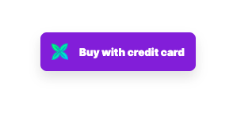
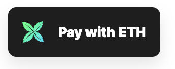

# Add crossmint button to your site 💻🔸

## 1️⃣ Install the Crossmint Client SDK

```
# run this command from the root directory of your project
  yarn add @crossmint/client-sdk-react-ui
```

## 2️⃣ Set up the payment button

```
// Add this import line at the top
<!-- import  {  CrossmintPayButton  }  from  "@crossmint/client-sdk-react-ui"; -->

// Add this component next to your minting button
<CrossmintPayButton
projectId="_YOUR_PROJECT_ID_"
collectionId="_YOUR_COLLECTION_ID_"  environment="_ENVIRONMENT_"
mintConfig={{
type:  "erc-721",
quantity:  "_NUMBER_OF_NFTS_",
totalPrice:  "_PRICE_IN_NATIVE_TOKEN_"
// your custom minting arguments...  }} />
```

> ⚠️ 🚨 Important
>
> The button props/attributes are case sensitive. Ensure that they are written in camelCase.  
> ❌`project-id` --> `projectId` ✅  
>  ❌`collection-id` --> `collectionId` ✅
> ❌`mint-config` --> `mintConfig` ✅  
> ❌`total-price` --> `totalPrice`✅

### 🔅 Explanation of Variables 🔅

| Chain  | Variable         | Description                                                                                                                                                                                                                                                                                                  |
| ------ | ---------------- | ------------------------------------------------------------------------------------------------------------------------------------------------------------------------------------------------------------------------------------------------------------------------------------------------------------ |
| All    | **projectId**    | Unique identifier of your project. Selected in the top navigation of dev console.                                                                                                                                                                                                                            |
| All    | **collectionId** | Identifier of the specific collection. Can be found in the left-hand navigation.                                                                                                                                                                                                                             |
| All    | **environment**  | staging or production                                                                                                                                                                                                                                                                                        |
| All    | **type**         | erc-721, erc-1155, thirdweb-drop, thirdweb-edition-drop, candy-machine                                                                                                                                                                                                                                       |
| EVM    | **quantity**     | Defines how many NFTs should be minted on the current checkout transaction.                                                                                                                                                                                                                                  |
| EVM    | **totalPrice**   | Equal the total price of the purchase. That is, the price per NFT multiplied by the number of NFTs. For example, if you are selling 2 NFTs at 0.1 ETH each, totalPrice should be 0.2. Price should be in the native currency of the contract (eg. ETH, MATIC, or USDC). And not in gwei or comparable units. |
| Solana | **mintingGroup** | Relevant if you've configured minting groups in your candy guards setup.                                                                                                                                                                                                                                     |
| Solana | **quantity**     | Defines how many NFTs should be minted on the current checkout transaction. Currently, we support a maximum of 5 at a time.                                                                                                                                                                                  |

> ### ℹ️ `totalPrice` limits in staging
>
> Crossmint imposes restrictions on the maximum price per purchase. Set the `totalPrice` or on chain NFT price, to no
> more than:
>
> - Ethereum (Goerli): 0.000005 ETH
> - Polygon (Mumbai): 0.005 MATIC
> - Solana (devnet): 0.001 SOL
> - Other chains: the equivalent of $0.10 in their native token

## 3️⃣ Customize Button Style

### Change style 🎨

**Add the className prop** and assign the name you want to use to change its style through CSS.

```
    <CrossmintPayButton
    ...
    className="xmint-btn"  />
```

CSS:

```
    button.xmint-btn{
      background-color: blueviolet;  }
```



### Changing the button text (reactjs) 🖊️

To customize **the Crossmint pay button text**, add the property `getButtonText` and create an inline function with the two parameters:

- **connecting**: A state in which the component is loading its packages  
  **paymentMethod**: returns the current payment method being used

You can then freely control the text depending on the state, as demonstrated below.

```
    <CrossmintPayButton
    getButtonText={(connecting,  paymentMethod)  =>
    connecting  ?  "Connecting"  :  `Pay with ${paymentMethod}`
     }
      />
```



## Additional features 🗂️

### Cross-chain Payments

Cross-chain payments allows clients **to purchase your listed NFT with either Solana or Ethereum**. The NFT could be listed on Polygon and using Crossmint, you’re able to accept Solana as a valid form of payment. Simply duplicate the payment button and add `paymentMethod="XX"` at the end of the SDK.

```
    //ETHEREUM
     <CrossmintPayButton  ...
     projectId="_YOUR_PROJECT_ID_"
      collectionId="_YOUR_COLLECTION_ID_"
       paymentMethod="ETH"  />
    //SOLANA
       <CrossmintPayButton  ...
     projectId="_YOUR_PROJECT_ID_"
      collectionId="_YOUR_COLLECTION_ID_"
       paymentMethod="SOL"  />
```

### Redirect URLs

The Redirect URL feature in the Crossmint Pay Button **allows users to specify a `successCallbackURL` or `failureCallbackURL`.** Upon completion of the checkout process, customers are redirected to either of these URLs depending on the result of the operation.
[See more here](https://docs.crossmint.com/docs/redirect-url#overview)
