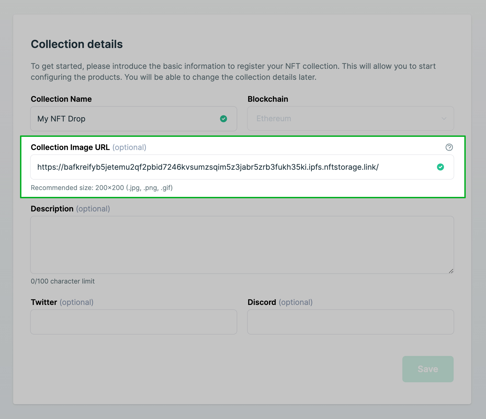
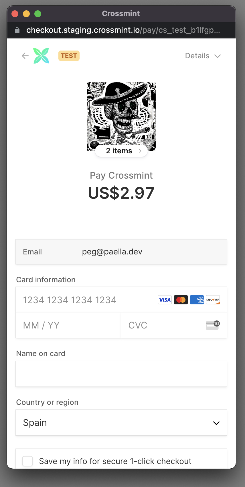
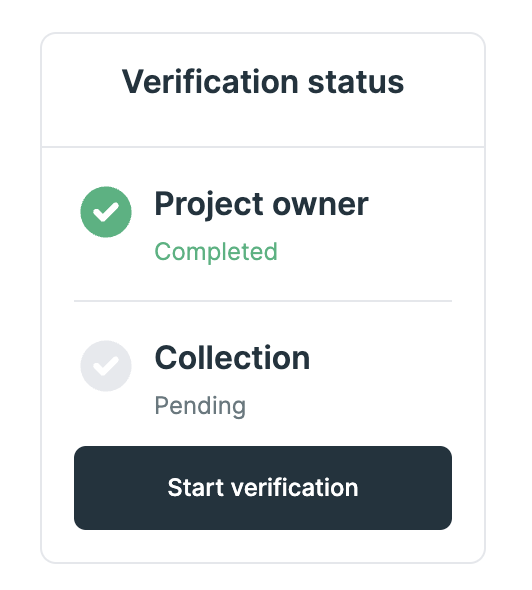

# Prepare for launch 🥳🏁"

## 1️⃣ Register your collection in our production developer console

Whenever possible you should begin using the staging environment to test everything out end to end.
Then, when staging is working perfectly create an ** identical collection in production ** and point it toward a mainnet smart contract.

## 2️⃣ Ensure that your collection has a photo URL

In the `<CrossmintPayButton>` component make sure that the **collectionPhoto attribute** is set to a URL of an image of your collection. Here's an example using our React SDK.



Your image will appear in the payment popup and look something similar to the following:



## 4️⃣ Complete the collection verification at least 48 hours before launch

Go to the detail view for your collection in the production environment and you'll see the verification status in the left hand navigation


Click the **"Start Verification"** button to share details about your project including website, social media accounts, etc. This step is critical and you must have the information submitted to begin accepting payments.

## 5️⃣ Default max transaction limit is $1500

All projects have a default max transaction limit in place. This limit is per purchase, which means that if your NFT price exceeds the limit you'll need to request this limit be raised for your project.

> Please note
> Crossmint typically **does NOT raise the limit** merely to support multiple NFTs in one transaction. For example, if your NFT price is $1000 crossmint is unlikely to approve an increase to $2000.

## 6️⃣ Add the environment="production" property to the button
While you're testing your drop you have to add the environment="staging" attribute to your button. Ensure that you remove this property or set it equal to environment="production" so that it works in production.

```
<CrossmintPayButton
  projectId="_YOUR_PROJECT_ID_"
  collectionId="_YOUR_COLLECTION_ID_"
	mintConfig={{
		quantity: "1",
		totalPrice: "0.25"
		// your custom minting arguments...
	}}
	environment="production"
/>
```

## 7️⃣ Test the button to ensure the checkout loads properly

After setting up everything for production, click through the button and make sure the popup is correctly appearing without any errors.
