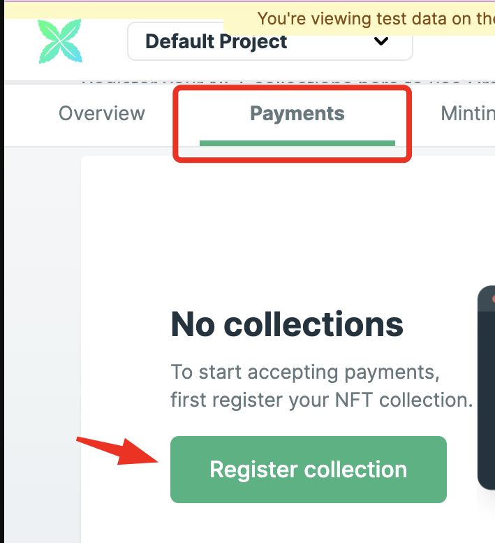
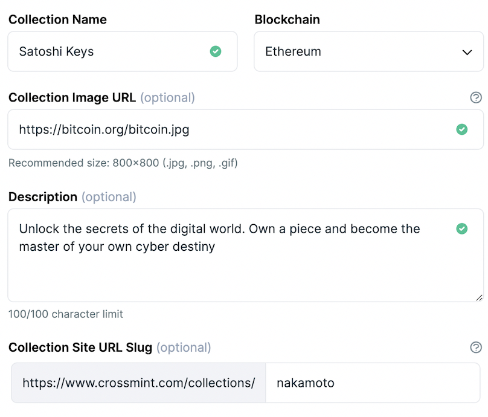

# Register your smart contract 🖊️🔴

## 1️⃣ Create a developer account 👤

If you haven't yet, start by creating an account on crossmint developer console. [https://www.crossmint.com/console/create-account](https://www.crossmint.com/console/create-account) When you’re creating a new collection, make sure that you select Ethereum, and then click ERC721 because that’s what we built our NFT smart contract with.

First create your collection on testnet(Staging), when staging is working perfectly create an identical collection in production and point it toward a mainnet smart contract or candy machine.
Make sure you're using all the Mainnet details for your drop. Use the production projectId and collectionId values and update these attributes in your `<CrossmintPayButton>` component with the production values.

## 2️⃣ Create a new collection ➕

You're in! The next step is creating a new collection. Click on the **"Payments" tab** and create a new one.

Now you need to **add basic information** about your collection. This is important because customers will see this information on the checkout flow! But don't worry, you'll be able to go back and edit it later.

## 3️⃣ Register your smart contract 🔴

- **EVM chains** (eg. Ethereum, Polygon, BNB, etc): see requirements
- **Solana**: Crossmint support Candy Machine v1, v2, and v3. To register the contract, simply paste the contract ID on the console

### 🔴 3.1 EVM contracts

Once you have your smart contract deployed, check if it meets our **requirements:**

1.  Your contract \***_must be_ ERC-721, ERC-721A, or ERC-1155\*** compliant.
2.  The minting function must **allow minting** directly to an address different than the one which invoked the contract. And it must contain at least one parameter that specifies that recipient address.
3.  A single address must be able to **call the mint function unlimited times but** does not need to be able to hold unlimited NFTs.

### 🔌 3.2 Register your contract

From the console on the Payments tab, click on your collection and then on **Contract registration**. Paste your contract address and the rest of fields should update automatically.

> Edge cases may not be processed correctly, so please verify everything is in order. Crossmint attempt to automatically select these values for you, but it's important to ensure they are set correctly:
>
> - The ABI of your smart contract in JSON format.
> - NFT recipient address
> - NFT amount
> - USDC Support, can be enabled by checking the "Enable USDC" checkbox in the contract registration.

## 4️⃣ Verify your account ✅

Just one last thing! Quickly **verify your identity** and the **collection.** On average, it takes just 2 minutes and 30 seconds. Crossmint does this for regulatory reasons, using a reputable third party (Persona), and doesn't store any personal information ourselves.
Now you're set! 🥳
