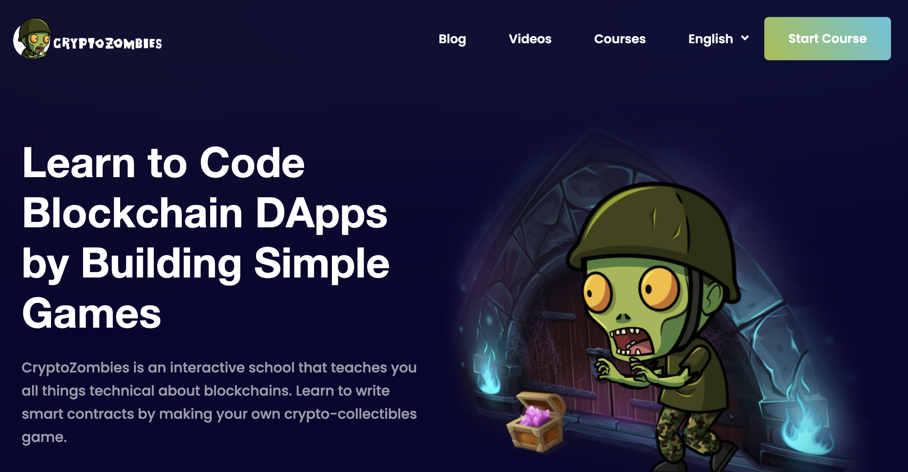

# 📚 Learning Solidity with CryptoZombies

As part of this introductory guide to Solidity, we recommend the interactive learning platform, **CryptoZombies**. 🎮 Offering an engaging experience similar to the JavaScript section on **FreeCodeCamp**, CryptoZombies is akin to a game where you learn to write Solidity code while constructing your own "zombie" game on the Ethereum blockchain. 🧟‍♂️

CryptoZombies follows a step-by-step methodology, progressively introducing new and intricate concepts. 📈 By the completion of the course, you will possess a robust grasp of Solidity's fundamentals and the principles of smart contract development, enabling you to continue your journey with this guide. Therefore, if you're a beginner, don't skip this section. 🚀

## 🙋‍♀️ Need Help? Join Our Discord Forum

We acknowledge the challenges that come with learning a new language, so we've established a support forum on **Discord**. This platform serves as a space for sharing any difficulties or questions you might have while engaging with CryptoZombies or navigating through our guide. We urge you to take advantage of this supportive community to augment your learning process.

[🔗 Join our Discord Forum](https://discord.com/channels/1133036886651322409/1133555350444966009)

Here's what you can do:

- **🙋‍♀️ Pose Queries**: Don't hesitate to ask any questions related to blockchain development.

- **👥 Request and Provide Assistance**: Encountering issues with coding or need feedback on a project? Request help here. Similarly, if you can answer a question or solve a problem, feel free to assist.

- **📖 Discuss the Guide**: We'll use this area for collaboration on our internal blockchain development guide. Feel free to share your thoughts, propose changes or updates, and provide feedback on the existing material.

Remember, the most effective learning comes from doing. So, delve into CryptoZombies, start creating, and don't hold back from seeking help when necessary. Happy coding! 👩‍💻👨‍💻

# 🎖️ Brief Summary

If after having studied and practiced using CryptoZombie 🧟‍♂️ you need a quick review of the basic concepts that you have found in the lessons, here is a summary of each lesson

Go to Lesson 1 📝 >>>

