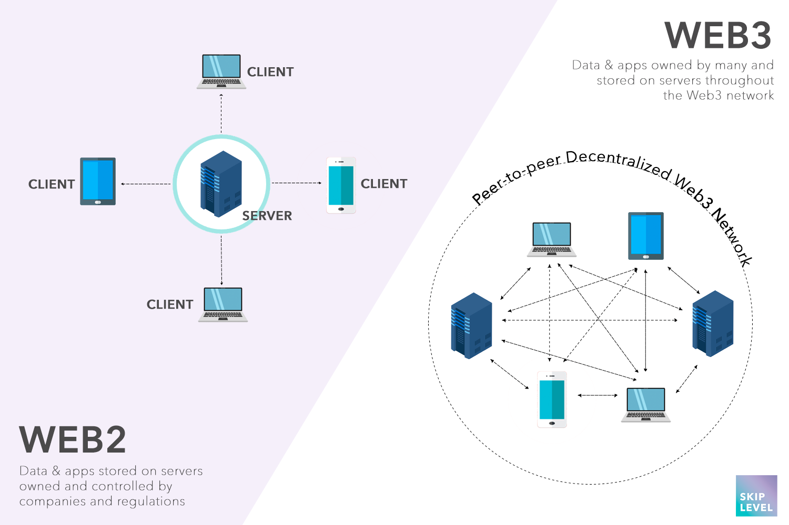

# What is Web3? 🌍

> A brief overview of what Web3 is, its evolution from Web2, and why it is important in the context of blockchain and the Internet of the future.

## An Overview Of Decentralization, Anonymity, And Security On The Internet 🔐

Web3 represents an innovative technology on the horizon, poised to revolutionize the concept of **freedom of expression** on the internet and eliminate the possibility of censorship by authorities that govern the surface of the "normal web." This groundbreaking advancement seeks to leverage the power of blockchain to ensure a **decentralized** and **censorship-resistant** internet experience.

### Web3 & Blockchain 🧑🏻‍💻

In Web3, websites and identities will be published **within blocks** situated inside a blockchain, **securely hosted** within millions of wallets. This prevents _deletion, censorship, and forgery_ of specific blocks, websites, or content. The foundation of Web3 is to integrate blockchain across existing technologies, from the internet to artificial intelligence.

### Web3 Evolution From Web2 🦖

**Decentralization** and **content ownership** are central themes in the Web3 ecosystem. With Web3, everything produced on the internet becomes the **property of the creator**, _granting them the freedom to decide how and if they want to monetize it._ The limitations of Web 2.0 are mainly attributed to centralization. While users can interact and create and share content, they must adhere to regulations imposed by various web platforms where content is published. Frequently, users find themselves compelled to remove or alter content to avoid censorship or bans.

### Web3 The Internet Of The Future. 🎖️

In the context of blockchain and the future of the internet, Web3 holds paramount importance. It envisions a decentralized, **trustless, and resilient internet**, where users have **full control** over their digital assets and interactions.

> Blockchain integration ensures transparency, immutability, and security, reducing the dependence on centralized authorities and intermediaries.

Web3 empowers individuals to truly own their data, eliminating the risk of censorship and fostering a more open and inclusive digital space.

As Web3 continues to evolve, it is set to shape the future of the internet and redefine how we interact, share information, and engage with technology. The journey from Web2 to Web3 signifies a paradigm shift towards a more democratized and user-centric online world.
