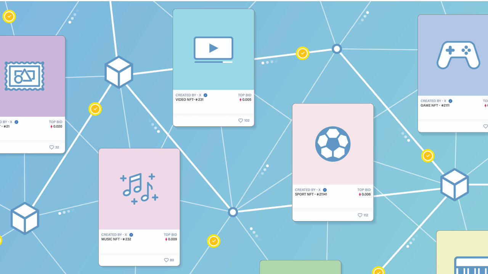

# How Does Web3 Works? 🤔

> A detailed explanation of how Web3 functions. This should include a discussion of its interaction with blockchains, smart contracts, and the token.

  
TL;DR: 🥱⏱️ 

  Web3 is the next evolutionary step in the development of the internet, transforming
  it into a decentralized, user-centric network. It operates on the principles of
  **decentralization, transparency, security, and user control**. Web3 relies on
  ***blockchain technology*** and other decentralized protocols to achieve these
  goals. Web3 heavily integrates with blockchain technology, using it as the *backbone*
  of the decentralized web. Web3 applications interact with blockchains for decentralized
  identity, secure transactions, data storage, trust, and transparency. Web3 leverages
  ***smart contracts***, which are self-executing contracts with terms and conditions
  directly written into code. Smart contracts enable automation and eliminate the
  need for intermediaries in Web3 applications. ***Tokens*** are digital assets that
  play a central role in the Web3 ecosystem. They are used for utility purposes,
  incentives, fundraising, governance, and voting. Tokens are often based on standardized
  protocols like ERC-20 and ERC-721, ensuring interoperability between different
  applications. Overall, Web3 empowers users by providing greater control over their
  data, digital assets, and interactions while reducing reliance on centralized intermediaries.
  It fosters the growth of decentralized applications and innovative use cases in
  various fields, including finance, identity management, and supply chain management.

## Web3 Interaction 🧩

Web3 aims to eliminate the need for central authorities and intermediaries that control user data and transactions. Instead, it relies on distributed networks, where data is stored across multiple nodes and consensus mechanisms are used to validate and record transactions.

- 🧊 **Blockchain Integration:** Web3 heavily integrates with blockchain technology, which acts as the _backbone_ of the decentralized web.Blockchains are immutable, transparent, and secure ledgers that store transactional data and ensure trust among participants.

- 🧠 **Smart Contracts:** Web3 leverages smart contracts, which are  
  self-executing contracts with the terms and conditions directly  
  written into code. These contracts automatically execute when  
  predefined conditions are met, _eliminating the need for  
  intermediaries_ and enhancing the automation and efficiency of  
  transactions.
- 🪙 **Tokens:** Tokens are digital assets that represent value and can be used within _decentralized applications_ and platforms. They are often used to incentivize users, participate in governance, and facilitate value transfer within the Web3 ecosystem.

## 1️⃣ Interaction With Blockchain: 🧊

Web3 applications interact with blockchains in the following ways:

-👤 **Decentralized Identity:** Web3 enables users to have self-sovereign identities stored on blockchains. This allows users to control their personal information and choose what data they share with different applications, reducing the reliance on centralized identity providers.

-🔐 **Secure Transactions**: Web3 applications use blockchain-based cryptocurrencies to facilitate secure and transparent peer-to-peer transactions. Users can directly transfer digital assets without the need for traditional intermediaries like banks.

-💾 **Data Storage**: Blockchain technology provides a secure and immutable storage solution for critical data and transactions. However, due to its limited capacity and high costs, Web3 applications often use other decentralized storage systems like IPFS (as discussed in the previous response) for non-sensitive data storage.

-🦮 **Trust and Transparency:** Web3 leverages blockchain's transparency and immutability to create trustless environments. Participants can verify the history of transactions and the authenticity of digital assets, increasing transparency and reducing the need for trust in third parties.

## 2️⃣ Interaction With Smart Contracts: 🧠

> Smart contracts are integral to Web3 applications, enabling automation and eliminating intermediaries.

Here's how Web3 interacts with smart contracts:

- 📱**Decentralized Applications (DApps):** Web3 applications are often DApps that leverage smart contracts to perform specific functions or execute complex logic on the blockchain. DApps are open-source and autonomous, running on a peer-to-peer network of nodes.

- 🪙**Token Standardization**: Most tokens in the Web3 ecosystem adhere to standardized protocols like ERC-20 (Ethereum Request for Comment 20) or ERC-721 for fungible and non-fungible tokens, respectively. These standards ensure interoperability between different applications and wallets.

- 👨🏻‍⚖️**Governance:** Web3 platforms use smart contracts for decentralized governance, enabling token holders to participate in decision-making processes. This democratic approach allows users to influence the direction of the platform and its development.

- 💸 **Decentralized Finance (DeFi)**: Web3 has seen significant growth in DeFi applications, which offer financial services like lending, borrowing, and trading through smart contracts. DeFi protocols operate without intermediaries, providing more accessible and inclusive financial services.

## 3️⃣ Interaction With Tokens: 🪙

Tokens play a central role in the Web3 ecosystem. Here's how they are used and interact within the decentralized web:

- 🪙 Utility Tokens: Many tokens in Web3 serve as utility tokens, providing access to specific features or services within DApps. For example, utility tokens may grant users access to premium features or exclusive content.
- 🏆 Incentives and Rewards: Tokens are often used to incentivize users to perform specific actions or participate in certain activities. Users may earn tokens for contributing to the network's growth, validating transactions, or participating in governance.
- 💸 ICOs and Fundraising: Initial Coin Offerings (ICOs) were popular in the early days of Web3, allowing projects to raise funds by selling their native tokens. This fundraising method has evolved into Security Token Offerings (STOs) and other token sales models.
- 👨🏻‍⚖️ Governance and Voting: Token holders can participate in platform governance by voting on proposals and protocol upgrades. This democratic approach ensures that decisions are made collectively by the community.

## 🏁 In Conclusion 🎉

Web3 functions by leveraging blockchain technology, smart contracts, and tokens to create a **decentralized, transparent, and user-centric internet ecosystem**. It empowers users to have greater control over their data, digital assets, and interactions while reducing reliance on centralized intermediaries. The integration of these technologies is driving the **growth** of decentralized applications, enabling **innovative** use cases in finance, identity management, supply chain, and more.
