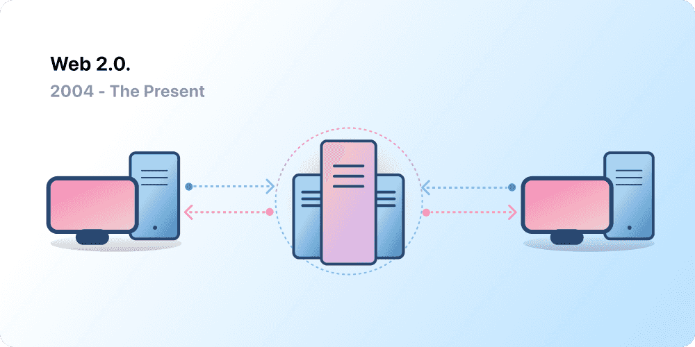

# Web History: From Web1.0 To Web3 👨🏻‍🏫

> A comparative description of Web1, Web2 and Web3, highlighting how each version has expanded the capabilities of the Internet.

Most people think of the Web as a continuous pillar of modern life—it was invented and has just existed since. However, the Web most of us know today is quite different from originally imagined. To understand this better, it's helpful to break the Web's short history into loose periods—Web 1.0 and Web 2.0.

## Let's make a jump into the past! 🐇🌀

### 🌍1️⃣ Web1.0: Read-Only (1990-2004)

The first inception of Berners-Lee's creation, now known as 'Web 1.0', occurred roughly between 1990 to 2004. Web 1.0 **was mainly static websites** owned by companies, and there was close to zero interaction between users - individuals seldom produced content - leading to it being known as the **read-only web.**

### 🌍2️⃣ Web 2.0: Read-Write (2004)

The Web 2.0 period began in 2004 with the emergence of social media platforms. Instead of a read-only, the web evolved to be read-write. Instead of companies providing content to users, they also began to provide **platforms to share user-generated content and engage in user-to-user interactions.** As more people came online, a handful of top companies began to control a disproportionate amount of the traffic and value generated on the web. Web 2.0 also birthed the advertising-driven revenue model. While users could create content, **_they didn't own it or benefit from its monetization._**

### 💪🏼 Web3.0 VS Web3 🦾

Web3 should not be confused with Web 3.0. The latter represents the evolution of the previous Web 1.0 and Web 2.0, aiming to **create semantically linked content**. Web 3.0 (theorized since 2006) seeks to enhance the existing network, making it more connected, engaging, and interactive. On the other hand, **Web3 aims to reinvent the internet**, fundamentally changing the assumptions that currently give rise to pages, websites, and platforms.

### 🌍3️⃣ Web3.0: Semantic Internet

It aims to leverage various technologies and paradigms, with one prominent example being artificial intelligence. The stated goal is to achieve the so-called "read-write-interact web": a network where users are not limited to reading or writing on pages but can interact in a much freer and spontaneous manner.

### 🌍3️⃣ Web3 🎖️

A new idea of a completely decentralized web, based on novel protocols, particularly **blockchain technology**. The objective is to radically change the current functioning of the network, **eliminating the distinction between client and server** by introducing blockchain. Blockchain entails storing information in **multiple copies** and distributing it within a peer-to-peer network of computers. Learn more from docs.

