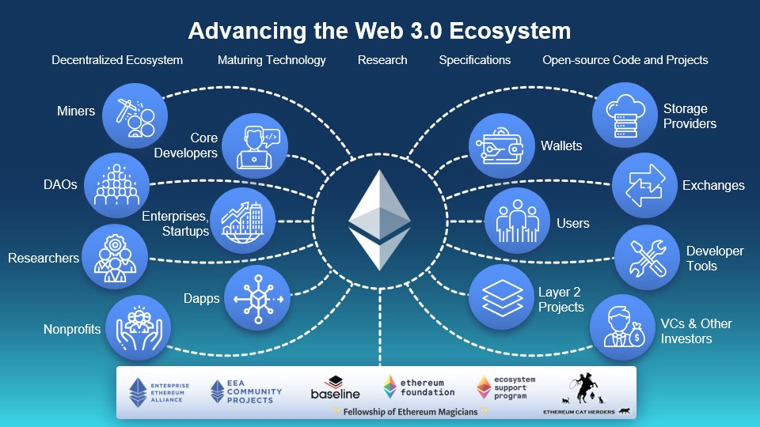

# Web3 and Ethereum 💎

> A specific section on the importance of Ethereum in the context of Web3, including its role in creating decentralized applications (dApps).

Ethereum plays a pivotal role in the context of Web3 as one of the most prominent and influential blockchain platforms. It has become the **foundation for building decentralized applications (dApps)** and smart contracts, driving the advancement of the decentralized web.

## 💎 Ethereum: central pillar of Web3's evolution 🌍

Let's explore the importance of Ethereum and its role in creating dApps within the Web3 ecosystem:

### 1️⃣ Smart Contract Platform: 🧠

Ethereum introduced the concept of smart contracts, which are self-executing agreements with predefined rules and conditions written into code. These contracts automatically execute when conditions are met, **eliminating the need for intermediaries and providing a trustless and transparent system.** Smart contracts serve as the backbone of dApps, enabling the creation of complex decentralized systems without relying on a centralized authority.

### 2️⃣ Decentralized Applications (dApps): 📱

Ethereum is the leading platform for developing and deploying dApps. Unlike traditional applications that rely on centralized servers, dApps run on a decentralized network of computers (nodes) that collectively maintain the application's state and data. This decentralized nature ensures that dApps are censorship-resistant, transparent, and secure, providing users **with greater control** over their data and interactions.

### 3️⃣ Interoperability and Standards: 👍🏼

Ethereum's robust ecosystem has led to the development of various standards and protocols, making it easier for developers to create interoperable dApps. The **ERC-20 standard,** for instance, allows developers to create fungible tokens that can be easily traded and used across different dApps. Additionally, the **ERC-721 standard** enables the creation of non-fungible tokens (NFTs), revolutionizing digital ownership and asset representation.

### 4️⃣ Decentralized Finance (DeFi): 💸

Ethereum has played a transformative role in the rise of decentralized finance (DeFi) applications. DeFi leverages smart contracts to offer **financial services such as lending, borrowing, trading, and yield farming without intermediaries.** The DeFi ecosystem has grown significantly on Ethereum, providing financial inclusivity, transparency, and accessibility to a broader user base.

### 5️⃣ Community and Developer Support: 🧑🏻‍💻

Ethereum boasts a vibrant and active community of developers, researchers, and enthusiasts. This strong support network has contributed to the continuous development and improvement of the platform. The community's collaborative efforts have led to various upgrades, such as Ethereum 2.0, aiming to address scalability, security, and energy efficiency concerns.

### 6️⃣ NFTs and Digital Ownership: 🪙

Ethereum's support for NFTs has revolutionized the concept of digital ownership and provenance. **NFTs enable unique, indivisible digital assets, such as art, collectibles, and virtual real estate, to be tokenized and traded on the blockchain**. This has opened up new possibilities for artists, creators, and collectors to tokenize and monetize their digital creations securely.

## 🏁 In Conclusion 🎉

In conclusion, Ethereum's importance in the context of Web3 **cannot be overstated**. As a smart contract platform and decentralized application ecosystem, it has paved the way for the decentralized web and **empowered developers** to build innovative and trustless applications. With its strong community support, robust ecosystem, and transformative impact on decentralized finance and digital ownership, Ethereum remains a **central pillar of Web3's evolution**, shaping the future of the internet towards a more open, inclusive, and decentralized paradigm.
