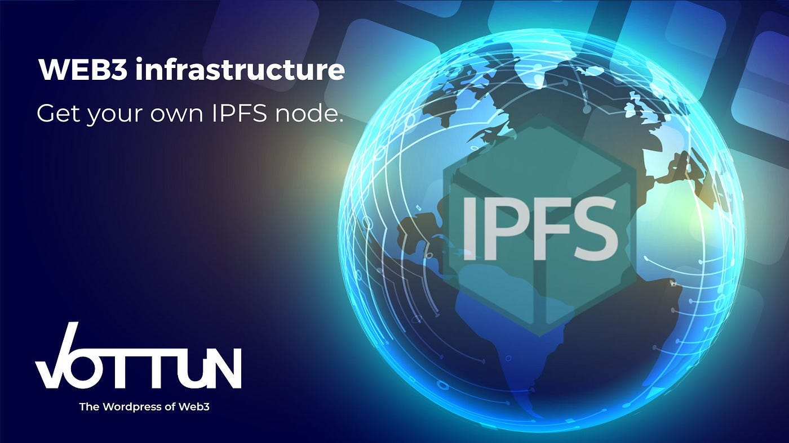

# Web3 and IPFS 💾

> **_A discussion on how Web3 interacts with systems like IPFS for decentralized storage._**

Web3 and IPFS (InterPlanetary File System) are two core technologies that contribute to the development of decentralized storage and the broader decentralized web. Let's discuss how Web3 interacts with IPFS for decentralized storage:

 

Web3 & IPFS Overview

### 1️⃣ Web3 Overview: 🌍

As we already said, Web3 refers to the third generation of the internet, focusing on the vision of a decentralized and user-centric internet. It aims to shift control and ownership of data and digital assets from centralized entities (like corporations) to individual users through blockchain and other decentralized technologies.

Web3 is built upon the principles of decentralization, transparency, security, and trustlessness. It leverages blockchain technology to enable peer-to-peer interactions, digital asset ownership, and decentralized applications (DApps).

### 2️⃣ IPFS Overview: 💾

**IPFS**, or _InterPlanetary File System_, is a distributed and peer-to-peer file storage system. It allows users to store and retrieve files using a content-addressable mechanism, where files are identified by their content's cryptographic hash rather than a location-based URL (like in the traditional HTTP protocol).

In IPFS, files are broken down into smaller chunks, and each chunk is given a unique hash. This enables content-based addressing, making it possible for multiple users to store and share the same content efficiently.

## **Interaction between Web3 and IPFS:**

Web3 and IPFS work together to provide decentralized storage solutions for various applications, especially in the context of DApps. Here's how they interact:

- 💾 **_Decentralized File Storage_**: Web3 applications often require
  decentralized file storage to store various types of data, including
  user data, app configurations, media assets, and more. IPFS serves as
  a perfect solution for this purpose, as it allows users to store
  files in a distributed manner, ensuring data redundancy and
  resilience against single points of failure.

-👍🏼 **_Immutable Content:_** IPFS ensures that the content stored within it is immutable. Once a file is added to IPFS and referenced by its
content-based hash, it cannot be changed or altered. This property
aligns well with the core principle of immutability in many
blockchain-based Web3 applications.

- 🪙 **_Off-Chain Data Storage:_** While blockchain technology provides
  secure and tamper-resistant data storage, it is often costly and
  limited in capacity. IPFS complements blockchains by providing an
  off-chain storage solution that can handle large volumes of data more
  efficiently. DApps can store non-sensitive data on IPFS while keeping
  critical data and transactions on the blockchain.

- 📱**_Decentralized Application Hosting:_** IPFS can also be used to host the frontend code and assets of Web3 applications. This enables
  truly decentralized applications where the frontend code is not
  reliant on centralized servers, making it more censorship-resistant
  and resilient.

- 🔗 **_Content Addressing and Sharing:_** IPFS's content-based addressing
  allows users to share content by sharing its cryptographic hash. This
  enables efficient content distribution and sharing among peers in a
  decentralized network.
